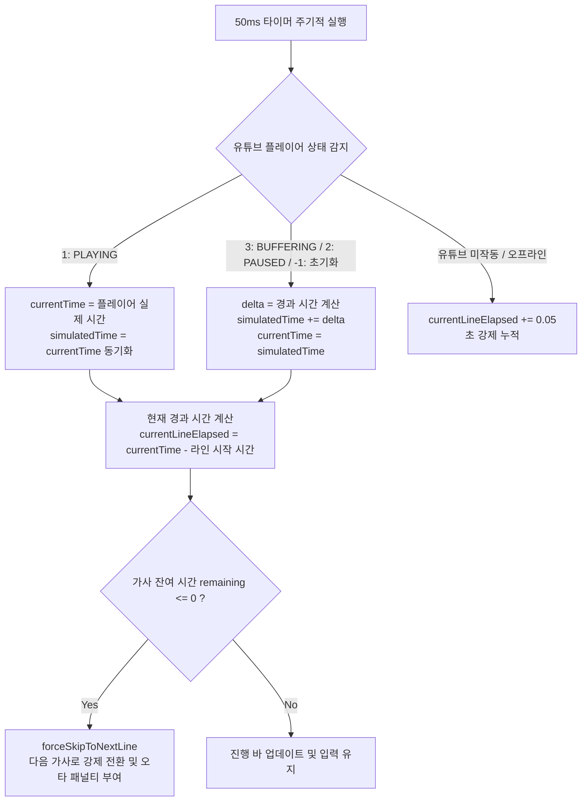

# ⌨️ 일반 타이핑 vs 실시간 대전 모드 기술 분석 및 비교 문서

이 문서는 엔터핑 서비스의 **일반 타이핑 모드(Solo Mode)**와 **실시간 대전 모드(Real-Time Battle Mode)**의 기술적 차이, 파일 호출 관계, 인게임 타이핑 처리 메커니즘, 그리고 **공통 타이핑 엔진(`shared_typing_engine.js`)**의 활용 방식에 대해 구체적으로 기술합니다.

---

## 1. 두 모드의 핵심 요약 및 기술 스택 비교

| 비교 항목 | 1인 연습 모드 (Solo Mode) | 실시간 대전 모드 (Battle Mode) |
| :--- | :--- | :--- |
| **목적** | 개인의 일본어 타자 연습 및 통계 축적 | 멀티플레이어 간 실시간 경쟁 및 순위 산정 |
| **주요 기술** | Vanilla JavaScript, Fetch API, HTML5 Audio | **FastAPI WebSockets**, **Redis** (세션 및 상태 저장), **YouTube IFrame Player API** |
| **통신 방식** | 단방향 HTTP API (완료 시 기록 저장) | 양방향 실시간 웹소켓 통신 (상태 패킷 브로드캐스트) |
| **게임 타이밍** | YouTube 영상 또는 내부 오디오 소스 재생 기준 | YouTube IFrame API 기반 씽크 제어 + 가상 타이밍 보정 루프 |
| **점수 반영** | 로컬 점수 연산 후 완료 시점 단일 기록 저장 | 타자 입력 시마다 실시간 점수 연산 후 웹소켓 공유 |

---

## 2. 파일 호출 구조 및 의존성 관계 (Architecture)

각 화면이 불러오는 리소스와 공통 엔진의 참조 관계는 아래와 같습니다.

```mermaid
graph TD
    subgraph 1인 모드 (Solo)
        TH[typing.html] --> SJS[script.js]
        TH --> STE[shared_typing_engine.js]
    end

    subgraph 대전 모드 (Battle)
        BH[battle.html] --> BJS[battle.js]
        BH --> STE[shared_typing_engine.js]
    end

    SJS -->|공통 함수 호출| STE
    BJS -->|공통 함수 호출| STE
```

### 📂 `shared_typing_engine.js` (공통 엔진)에서 내보내는 핵심 API
이 파일은 브라우저 전역 객체(`window`)에 바인딩되어 두 모드에서 동일하게 호출됩니다.
1. `parseKanaToTargetUnits(kanaString, mustCombine)`: 히라가나 문장을 요음/촉음 단위로 분석해 입력 가능한 로마자 배열을 만듭니다.
2. `ko2en(str)`: 한글 입력기를 켠 채로 타자 시 영문 키 배열로 자동 교정해 주는 UX 보정 유틸리티입니다.
3. `calculateTypingScore(accuracy, typingRatio, timeRatio, difficulty)`: 엔터핑 공인 타이핑 점수 공식을 구현한 핵심 수학 모듈입니다.
4. `getCompletedRomajiLength(units, currentIdx)`: 현재 입력 중인 로마자의 완성된 글자 길이를 계산합니다.

---

## 3. 타이핑 시 동작하는 코드 및 실행 흐름 (Typing Flow)

사용자가 키보드를 입력할 때 두 모드에서 작동하는 실시간 코드 흐름의 세부 사항입니다.

### 1) 일반 타이핑 모드 (`script.js` 중심)
```
[사용자 입력] ──> input 이벤트 발생 
                 └──> handleTypingInput(e) 호출
                         ├──> ko2en(rawValue) 실행 (한영 자동 교정)
                         ├──> parseKanaToTargetUnits 결과를 토대로 Romaji 패턴 대조
                         │       ├──> 일치 시: currentUnitIndex 증가 & 버퍼 초기화
                         │       └──> 오타 시: typoCount 누적 & 입력창 흔들림 연출
                         ├──> updateStats() 호출: 타수(WPM) 및 정확도 계산 후 DOM 즉시 반영
                         └──> 전체 완료 시: /api/typing-history (HTTP POST)로 기록 영구 저장
```

* **WPM 계산식**:
  $$\text{WPM} = \frac{(\text{전체 입력 키} - \text{오타 수}) / 5}{\text{경과 시간(분)}}$$

---

### 2) 실시간 대전 모드 (`battle.js` + `main.py` + Redis)
대전 모드는 멀티플레이 동기화를 위해 웹소켓 패킷 송수신 흐름이 추가됩니다.
```
[사용자 입력] ──> input 이벤트 발생
                 └──> handleTypingInput(e) 호출 (battle.js)
                         ├──> ko2en(rawValue) 실행 및 로마자 대조
                         ├──> calculateScore() 실행: 실시간 정확도, 남은 시간 비율을 연산
                         ├──> calculateMyProgress() 호출
                         │       ├──> 내 진행도 % 계산 및 실시간 랭킹판(Live Ranking) 재정렬
                         │       └──> battleSocket.send()를 통해 진행도 패킷 송신
                         │            [JSON 데이터 예시]
                         │            {
                         │               "type": "progress",
                         │               "progress": 45.5,
                         │               "wpm": 420,
                         │               "accuracy": 98,
                         │               "score": 1250
                         │            }
                         └──> 서버 수신 (main.py) 및 Redis 상태 갱신
                                 └──> 다른 대전 플레이어들에게 브로드캐스트
                                 └──> 플레이어별 수신 즉시 renderLiveRanking()으로 상대방 바 갱신
```

* **실시간 순위 정렬**:
  각 클라이언트는 수신한 플레이어 상태 정보(`opponents`)를 바탕으로 `renderLiveRanking()` 내에서 `flex-direction: column` 구조 안의 `row.style.order` 속성을 조정하여 화면에 실시간 순위 변동을 매끄럽게 렌더링합니다.

---

## 4. 공통 타이핑 엔진 (`shared_typing_engine.js`) 상세 원리

### 1) 가나 문자 파싱 및 요음/촉음 대응 (`parseKanaToTargetUnits`)
일본어는 요음(`きゃ`, `しゅ` 등)과 촉음(`っ`)의 처리 방식이 다양하여 단순 문자 매칭이 불가합니다. 공통 엔진은 이를 **음절/타이핑 단위**로 병합 분석합니다.

* **촉음(っ) 처리**:
  * 촉음 뒤에 오는 문자의 첫 로마자 자음을 중복하여 입력하는 규칙을 자동 연산합니다.
  * 예: `った` 입력 시 `tta`와 촉음 단독 키(`xtsu`, `ltsu`) + `ta` 조합 모두를 허용 리스트(`validInputs`)에 추가합니다.
* **요음 처리**:
  * `き` + `ゃ` -> `kya` 뿐만 아니라 `ki` + `xya` 형태로 쪼개서 치는 정석 타법과 우회 타법을 모두 `combinationRules`와 조합하여 다중 후보군으로 인식합니다.

### 2) 한영 키 배열 교정 (`ko2en`)
* 한글은 `초성(19자)`, `중성(21자)`, `종성(28자)`의 조합 코드로 저장되므로, 입력된 글자를 자소 분해 공식(Unicode offset 계산)을 사용해 자모 단위로 쪼갭니다.
* 분해된 각 자모를 표준 2벌식 배열에 매핑된 영문 알파벳 키(`KO_JA_MO`)로 1:1 변환하여 영타 상태로 강제 전환해 줍니다.
* 예: `야` -> `ㅑ` -> `i`, `안` -> `ㅇ`+`ㅏ`+`ㄴ` -> `d`+`k`+`s` -> `dks`

### 3) 공통 타이핑 점수 공식 (`calculateTypingScore`)
두 모드 모두 동일한 모듈을 호출하여 스코어의 공정성을 확보합니다.

$$\text{BaseScore} = \text{TypingRatio} \times 100 \times (\text{Accuracy})^2 \times \text{DiffWeight}$$
$$\text{FinalScore} = \text{BaseScore} \times (1 + \text{TimeRatio} \times 0.12)$$

* **정확도 패널티**: 정확도(`Accuracy`)를 **제곱($\text{Accuracy}^2$)**으로 반영하여 타수가 아무리 빠르더라도 오타가 많으면 점수가 기하급수적으로 하락합니다.
* **시간 보너스**: 남은 시간 비율(`TimeRatio`)에 비례하여 최대 12%의 추가 보너스를 획득할 수 있습니다.

---

## 5. 실시간 대전 모드 타이밍 동기화 메커니즘 (Sync & Timing)

실시간 대전 모드는 다수의 플레이어가 동시에 접속하여 동일한 유튜브 영상을 기준으로 경쟁하므로, 클라이언트마다 네트워크 상황 및 유튜브 로딩 지연이 발생할 수 있습니다. 이를 해결하기 위해 **하이브리드 가상 시간 동기화 루프**를 설계하여 구동합니다.

### 1) 시간 동기화 핵심 변수
* `ytPlayer.getCurrentTime()`: YouTube 플레이어가 제공하는 실제 미디어 재생 시간 (초 단위 실수).
* `simulatedTime`: 버퍼링이나 일시 정지 시 재생 끊김 현상을 방지하기 위해 사용하는 로컬 가상 시간.
* `selectedSong.timestamps`: 각 가사 라인(Stage)이 시작되고 종료되는 기준 시간 배열 (예: `[0.0, 12.5, 24.8, ...]`).
* `currentSectionDuration`: 현재 스테이지 가사에 배정된 총 유효 시간 ($T_{\text{next}} - T_{\text{current}}$).
* `currentLineElapsed`: 현재 가사 라인에서 경과된 시간.

---

### 2) 하이브리드 가상 타이머 보정 알고리즘
매 50ms마다 구동되는 타이머(`syncTimer = setInterval(..., 50)`) 안에서 유튜브 상태에 따라 씽크를 실시간으로 교정합니다.



#### ① 정상 재생 중 (`PLAYING`, state = 1)
* 유튜브 영상이 밀림 없이 정상 구동될 때에는 플레이어의 실제 타임라인(`ytPlayer.getCurrentTime()`)을 절대적 기준값으로 삼습니다.
* 오차 보정을 위해 가상 시간 변수인 `simulatedTime`을 실제 재생 시간으로 계속 갱신합니다.

#### ② 로딩 및 일시정지 중 (`BUFFERING`, `PAUSED`, `-1`)
* 네트워크 불안정으로 동영상이 멈추거나 버퍼링이 생기면 플레이어 시간도 정지하게 됩니다.
* 이때 현실 시간 경과량인 `delta`를 구해 `simulatedTime`에 누적 연산하고, 이를 가상의 `currentTime`으로 삼아 타이머를 굴립니다.
* **효과**: 플레이어 일부가 인터넷 렉으로 인해 유튜브가 멈추더라도, 가사 잔여 시간과 타이머는 동기화가 끊기지 않고 흘러가 게임 흐름이 파괴되지 않습니다.

---

### 3) 대기 단계(Waiting Phase)와 진행 단계(Gameplay Phase) 판정
각 가사의 실제 시작 시간(`timestamps[currentLineIndex]`)보다 유튜브 현재 시간(`currentTime`)이 느릴 때 가상 타이머가 이를 감지하여 단계를 분기합니다.

* **대기 단계 (`currentTime < timestamps[currentLineIndex]`)**:
  * 전주 구절이 흐르거나 가사 사이에 휴식 구간이 있는 경우입니다.
  * 입력창(`input`)을 비활성화(`disabled = true`)하고, 플레이스홀더에 카운트다운 또는 대기 메시지를 표시합니다.
  * 진행 바(`ProgressBar`)는 이전 가사 종료 시점부터 다음 가사 시작 시점까지의 경과 비율을 표현합니다.
* **진행 단계 (`currentTime >= timestamps[currentLineIndex]`)**:
  * 유튜브 시간이 가사 시작 타임스탬프를 넘어선 즉시 `loadGameplayLine()`을 호출하여 가사를 화면에 띄우고 입력창을 활성화합니다.

---

### 4) 미완성 가사 강제 스킵 패널티 (`forceSkipToNextLine`)
가사 제한 시간이 초과할 때까지 타자를 다 치지 못했을 때 가혹한 오타 패널티를 부여하여 부정행위를 차단합니다.

* **경과 계산**: `duration - currentLineElapsed <= 0`이 성립하면 강제 스킵이 트리거됩니다.
* **패널티 적용**:
  * 전체 글자 수 대비 사용자가 타이핑 완료한 글자 수(`lineCorrect`)를 구합니다.
  * 남은 입력하지 못한 로마자 알파벳 개수를 계산해 이를 **오타 수(`typoCount`)** 및 **총 입력 키(`totalKeysTyped`)**에 강제 가산합니다.
  * 해당 라인의 획득 시간 보너스는 `0`으로 처리됩니다.
  * 계산이 끝난 후 즉시 `currentLineIndex`를 1 증가시키고 다음 라인으로 화면을 강제 전환합니다.

