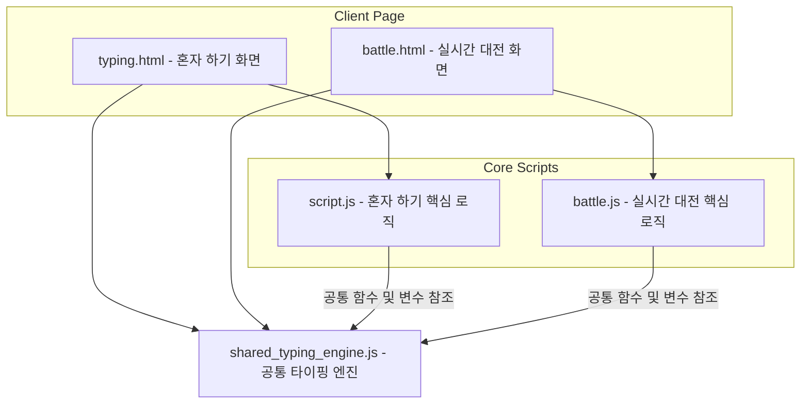
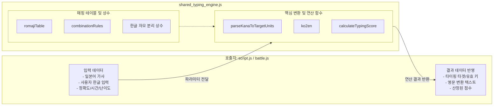
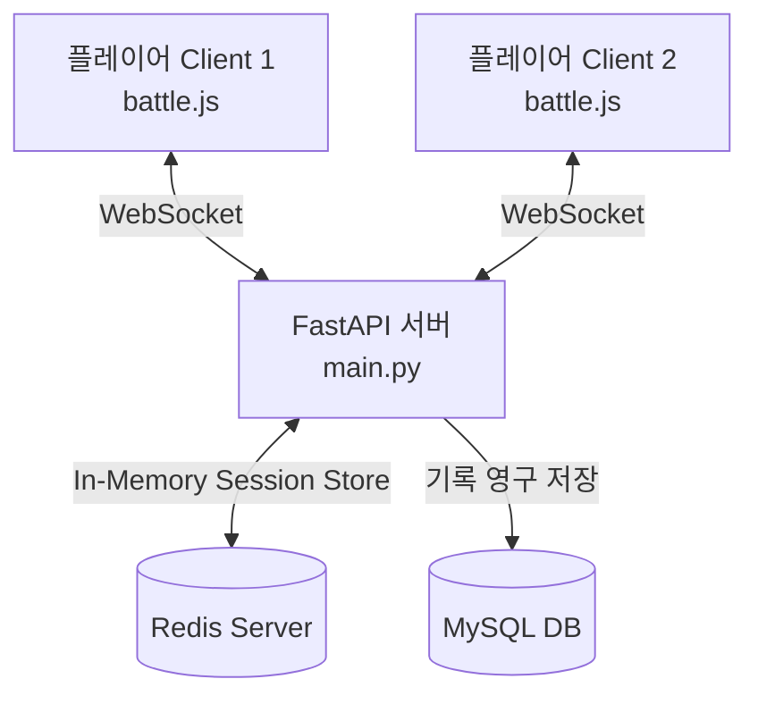
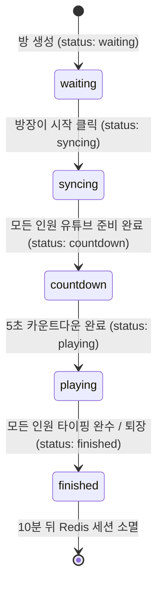
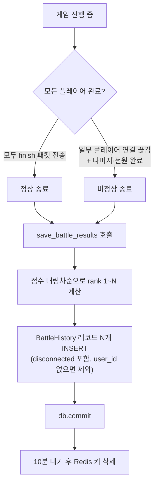
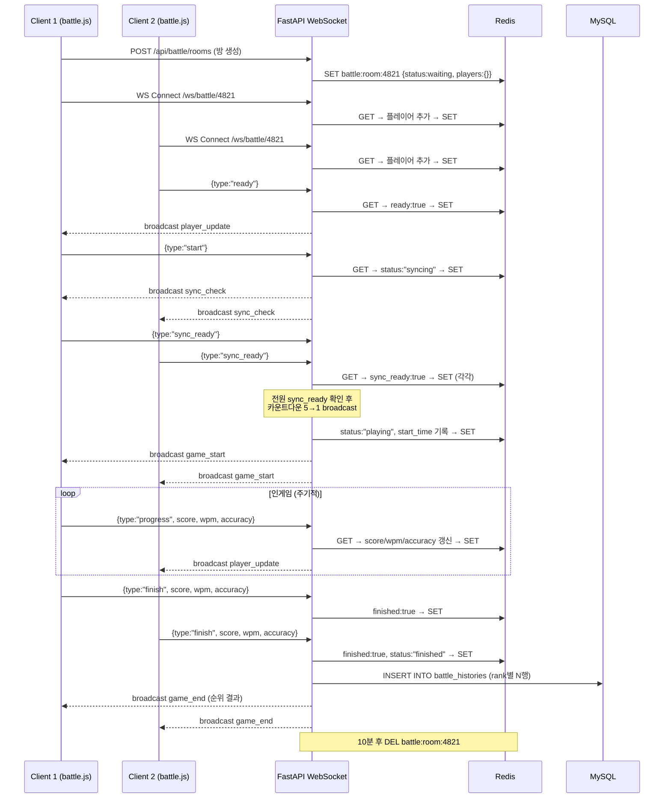

# 엔터핑 타이핑 시스템 아키텍처 문서 (Typing System Architecture)

엔터핑 서비스의 타이핑 연습 및 실시간 대전 모드에 사용되는 JavaScript 소스코드 구조와 핵심 엔진의 공유 설계 문서입니다.

---

## 1. 아키텍처 개요 (Overview)

엔터핑의 타이핑 시스템은 **1인 연습 모드(Solo Mode)**와 **실시간 대전 모드(Real-time Battle Mode)** 두 가지 구동 환경을 제공하며, 입력 처리 및 핵심 게임 수학 연산의 중복을 방지하기 위해 **공통 타이핑 엔진(Shared Typing Engine)**을 중심으로 모듈화되어 있습니다.



### 1.1 공통 엔진 분리 배경 (Rationale)

타이핑 및 점수 계산 등의 핵심 비즈니스 로직을 `shared_typing_engine.js`로 분리하여 설계한 핵심 이유는 다음과 같습니다:

1. **코드 중복 방지 및 개발 효율성**: 1인 모드(`script.js`)와 실시간 대전 모드(`battle.js`) 양쪽에서 사용되는 문자 변환(`ko2en`), 가나 파싱(`parseKanaToTargetUnits`), 자모 결합 규칙 및 로마자 변환 테이블 등의 핵심 알고리즘 중복 작성을 피하고 단일 코드베이스로 관리합니다.
2. **점수 계산의 일관성 및 공정성**: 혼자 하기 모드와 경쟁을 벌이는 대전 모드의 점수 계산 방식(`calculateTypingScore`)을 완전히 일치시켜 대전 경쟁에서의 정교함과 공정성을 확보합니다.
3. **유지보수의 용이성**: 타이핑 규칙(일본어 가나-로마자 규칙, 한글 오타 보정 규칙 등)이나 점수 공식 수정이 필요할 때 공통 엔진 파일 하나만 수정해도 양쪽 서비스에 즉시 동기화 적용됩니다.
4. **관심사 분리 (Separation of Concerns)**: 핵심 게임 알고리즘과 화면 제어/웹소켓 통신 레이어를 격리하여 각 파일의 역할이 가볍고 명확하게 유지됩니다.

#### ⚠️ 분리하지 않았을 때 발생하는 구체적 오류

만약 `shared_typing_engine.js`를 만들지 않고 동일한 로직을 `script.js`와 `battle.js` 양쪽에 각각 복사해 넣었을 경우, 다음과 같은 실질적 버그가 발생합니다.

| # | 오류 유형 | 발생 원인 | 증상 |
|---|---|---|---|
| 1 | **전역 변수 충돌** | `romajiTable`, `combinationRules` 등 같은 이름의 변수가 두 파일에 중복 선언됨 | 두 스크립트가 동시에 로드되는 페이지에서 `Uncaught SyntaxError: Identifier 'romajiTable' has already been declared` 발생 |
| 2 | **점수 불일치 (채점 기준 분열)** | 한쪽 파일의 `calculateTypingScore`만 수정되고 다른 쪽이 누락됨 | 솔로 모드 80점 = 대전 모드 95점이 되는 등 같은 플레이임에도 점수가 달라져 순위 공정성 훼손 |
| 3 | **가나 입력 판정 불일치** | `combinationRules` 또는 `romajiTable`이 두 파일 간 내용이 달라짐 | 솔로 모드에서 `tsu`로 인정되던 입력이 대전 모드에서 오타 처리되거나, 그 반대 현상 발생 |
| 4 | **한영 변환 버그 편향 수정** | `ko2en` 버그를 `script.js`에서만 수정하고 `battle.js` 수정을 누락 | 대전 모드 사용자만 한글 입력 교정이 안 되어 입력값이 모두 오타로 처리됨 |
| 5 | **사일런트 로직 드리프트** | 두 파일이 오랜 기간 독립적으로 수정되면서 규칙 테이블이 점진적으로 달라짐 | 겉보기엔 작동하는 것 같지만 특정 글자(예: `っ`, `ん`)에서만 솔로/대전 판정이 다르게 나오는 재현하기 어려운 간헐적 버그 발생 |

**핵심 시나리오 예시: `combinationRules` 드리프트**

```
[수정 전] 두 파일 모두: っ → 자음 연타 허용 (tto, kka, ...)
[수정 후] script.js만: っ → xtsu 단독 입력도 추가 허용
          battle.js: 변경 없음 (누락)

결과:
  - 솔로 모드: xtsu 입력 → ✅ 정타
  - 대전 모드: xtsu 입력 → ❌ 오타 처리 (다음 글자로 넘어가버림)
  → 대전 참가자가 솔로에서 익힌 타법이 대전에서 통하지 않는 UX 혼란
```



---

## 2. 파일별 역할 분담

### 📂 공통 엔진: `shared_typing_engine.js` (적용 범위: 전체 화면)
* **목적**: 1인 연습 모드와 실시간 대전 모드에서 공통으로 사용되는 자판 번역, 점수 산정식 및 문자 단위 파싱 유틸리티를 한데 모아 관리합니다.
* **주요 상수 및 변수**:
  * `romajiTable`: 일본어 가나(히라가나/가타카나) 문자를 로마자로 대응시키기 위한 맵 테이블.
  * `combinationRules`: 요음/촉음 등 복합 문자 입력 시 허용되는 로마자 조합 규칙 테이블.
  * `KO_CHO`, `KO_JUNG`, `KO_JONG`, `KO_JA_MO`: 한글 타이핑 입력을 실시간으로 영타로 교정하기 위한 2벌식 분해 상수.
* **주요 함수**:
  * `parseKanaToTargetUnits(kanaString, mustCombine)`: 일본어 문장을 입력 단위별(음절)로 쪼개고, 각 음절별로 타이핑 가능한 로마자 후보 목록(`validInputs`)을 생성하여 반환합니다.
  * `ko2en(str)`: 한글 입력을 영문 키보드 자판 레이아웃 기준으로 실시간 변환해 주는 공통 한영 교정 함수입니다.
  * `getCompletedRomajiLength(units, currentIdx)`: 현재 타이핑 완료한 가나 구간까지의 대표 로마자 글자수 길이를 산출합니다.
  * `calculateTypingScore(accuracy, typingRatio, timeRatio, difficulty)`: 난이도별 가중치, 입력 완성도, 남은 시간 비율, 정확도를 활용하여 엔터핑 공인 계산법에 따른 점수를 정수로 산정합니다.

### 📂 혼자 하기 제어: `script.js` (적용 범위: 1인 모드)
* **목적**: 1인 연습 모드(`typing.html`) 페이지의 비즈니스 로직 및 싱글 플레이 상태 관리를 담당합니다.
* **주요 기능**:
  * **싱글 플레이 제어**: 게임의 시작, 일시 정지, 재개, 스페이스바 카운트다운 및 볼륨 조절.
  * **싱글 통계 처리**: 1인 플레이 도중 경과 시간을 세고 타수(WPM), 오타수, 누적 점수 실시간 연산 및 표시.
  * **오타 통계 및 결과 모달**: 각 스테이지별 오타(타이핑 에러 및 시간초과 에러)의 상세 데이터를 수집해 구간별 오타 분석 리스트와 랭킹 TOP 5 컴포넌트를 렌더링합니다.
  * **기록 서버 저장**: 게임 완수 시 서버 API(`/api/typing-history`, `/api/typo-stats`)로 HTTP Fetch 요청을 보내 내 프로필 및 오타 분석용 원천 데이터를 영구 저장합니다.

### 📂 실시간 대전 제어: `battle.js` (적용 범위: 멀티플레이 모드)
* **목적**: 실시간 대전 모드(`battle.html`)의 멀티플레이 게임 플레이 및 방(Room) 관리, 웹소켓 통신을 관리합니다.
* **주요 기능**:
  * **대기방 및 웹소켓 통신**: 방 생성/입장, 준비 완료(Ready) 상태 전송, 대기실 실시간 대화 전송.
  * **멀티플레이어 로딩 동기화**: 참여자들의 유튜브 영상 캐싱 상태를 받아 준비가 끝나면 동시에 카운트다운을 시작하고 곡을 재생합니다.
  * **실시간 진행도 및 스코어 공유**: 인게임에서 타자를 칠 때마다 자신의 진행 상황(WPM, 정확도, 점수, 진행률%)을 주기적으로 서버와 대전 상대들에게 전송합니다.
  * **실시간 순위표 갱신**: 대전 상대들의 웹소켓 패킷을 수신해 실시간으로 화면의 상대방 프로필 컴포넌트 순위(Flex Order)와 진행 바 위치를 업데이트합니다.
  * **결과 포디움**: 대전이 끝나면 등수별로 1위, 2위, 3위 수상대 연출 및 점수 테이블을 렌더링합니다.

---

## 3. 핵심 공통 로직 상세 설명

### 🧮 1. 공통 타이핑 점수 산정 공식 (`calculateTypingScore`)
엔터핑의 모든 모드에서는 동일한 공식으로 점수를 계산하여 공정성을 보장합니다.
$$\text{Score} = \text{baseScore} \times (1 + \text{timeRatio} \times 0.12)$$
$$\text{baseScore} = \text{typingRatio} \times 100 \times (\text{accuracy})^2 \times \text{diffWeight}$$

* **정확도제곱 가중**: 정확도가 낮아질수록 점수가 급격하게 깎이도록 정확도를 제곱($\text{accuracy}^2$)하여 반영합니다.
* **난이도 가중치 (`diffWeight`)**: 난이도에 따라 다음과 같은 가중치가 부여됩니다:
  * 난이도 1: `0.8` / 난이도 2: `0.9` / 난이도 3: `1.0` / 난이도 4: `1.1` / 난이도 5: `1.2`
* **시간 보너스**: 남은 시간에 비례하여 최대 12%의 점수가 가산됩니다.

### ⌨️ 2. 실시간 한영 변환 (`ko2en`)
* 사용자가 실수로 한글 입력기 상태에서 타이핑을 시작하더라도 끊김 없이 흐름을 이어가도록 돕는 UX 보정 로직입니다.
* 초성, 중성, 종성을 쪼개고 이를 영문 2벌식 레이아웃으로 변환하여 영어 입력 모드로 변경할 번거로움을 줄여 줍니다.

---

## 4. 실시간 대전 아키텍처 상세 설계 (Real-Time Battle Architecture)

실시간 대전 모드는 네트워크 레이턴시가 존재하는 환경에서 다수의 플레이어가 동일한 음악 파일과 유튜브 영상 재생 시간을 기준으로 동기화되어 타이핑을 경쟁하는 시스템입니다.

### 🏗️ 1. 아키텍처 구성 요소 (Architecture Components)



* **Client (프론트엔드)**:
  * `battle.html` / `battle.js`로 구성되어 있으며, **YouTube IFrame Player API**와 연동됩니다.
  * 서버와 양방향 웹소켓 통신을 하며 현재 프레임의 진행율(%), WPM, 정확도, 점수를 실시간으로 브로드캐스트합니다.
* **Backend (백엔드 - FastAPI)**:
  * 웹소켓 연결 관리자인 `BattleConnectionManager`를 통해 방(Room) 단위 세션을 메모리에 유지합니다.
  * 플레이어의 입퇴장, 상태 변경(Ready), 게임 진행률 패킷을 받아 대화방에 참여한 모든 인원에게 실시간으로 브로드캐스트합니다.
* **In-Memory Cache (Redis)**:
  * 분산 환경에서의 방 정보 일관성 유지를 위해 Redis에 대전 방 정보 세션(`battle:room:{room_code}`)을 JSON 포맷으로 저장 및 관리합니다.
* **Database (MySQL)**:
  * 대전이 최종 종료(`finished` 상태 전이)되면 모든 플레이어의 성적 데이터를 `battle_history` 테이블에 영구 기록합니다.

---

### 🔄 2. 대전 방 상태 머신 (Room State Machine)

Redis 및 웹소켓 세션에 기록되는 방 상태(`status`)의 생명 주기 흐름입니다.



1. **`waiting` (대기 중)**: 플레이어들이 입장하고 준비 상태(`ready`)를 전환합니다.
2. **`syncing` (로딩 동기화)**: 모든 비방장이 준비를 마친 뒤 방장이 시작을 누르면, 모든 플레이어의 브라우저에서 유튜브 플레이어가 제대로 준비되었는지 체크(`sync_ready` 수집)합니다.
3. **`countdown` (카운트다운)**: 모든 클라이언트의 플레이어가 로드 완료되면 서버 스케줄러가 카운트다운(5, 4, 3, 2, 1) 패킷을 매 초마다 브로드캐스트합니다.
4. **`playing` (진행 중)**: 모든 플레이어의 화면에서 유튜브 비디오가 동시 재생되며 타이핑 입력이 활성화됩니다.
5. **`finished` (종료)**: 모든 플레이어의 입력을 완료 혹은 기권(퇴장)으로 간주한 뒤 시상대 UI를 렌더링하고, RDB에 성적을 기록합니다.

---

### ⏱️ 3. 네트워크 지연(Latency) 극복 및 동기화 메커니즘

서로 다른 네트워크 환경을 가진 플레이어 간의 타이밍 씽크를 맞추기 위해 **하이브리드 시간 동기화 루프**를 사용합니다.

1. **유튜브 플레이어 시간 매핑 (`ytPlayer.getCurrentTime()`)**:
   * 유튜브 영상이 정상 재생 중(PLAYING)일 때는 플레이어의 실제 시간 축을 그대로 추적하여 로컬 가상 시간인 `simulatedTime`을 리셋합니다.
2. **네트워크 버퍼링 및 일시 중지 대응 (가상 타이머 보정)**:
   * 특정 플레이어의 인터넷 불안정으로 인해 비디오가 멈춤(BUFFERING, PAUSED) 상태가 되었을 때에도, 현실 시간 기반의 `delta` 값만큼 `simulatedTime`을 계속 누적시킵니다.
   * 이를 통해 비디오가 일시 정지되거나 로딩이 길어져도 **가사 타이머 바는 끊김 없이 흐르게 되어** 게임 흐름이 파괴되는 것을 방지합니다.
3. **지연 구간 락 및 강제 전환 (`forceSkipToNextLine`)**:
   * 각 가사 구간의 종료 시간(Timestamp)까지 사용자가 입력을 완료하지 못한 경우, 클라이언트는 `forceSkipToNextLine()`을 실행하여 미완성 글자 수만큼 오타(Typo) 패널티를 부여한 후 다음 스테이지로 강제 스킵합니다.

---

## 5. 실시간 대전 DB 저장 구조 (Battle Data Persistence)

실시간 대전은 **두 개의 저장소**를 역할에 따라 명확히 분리하여 사용합니다.

| 저장소 | 역할 | 데이터 수명 |
|---|---|---|
| **Redis** | 게임 중 실시간 상태 (휘발성) | 방 생성 시부터 최대 2시간 (TTL) |
| **MySQL** | 최종 성적 영구 기록 | 무기한 |

---

### 🔴 Redis — 실시간 방 세션 저장

**키 이름**: `battle:room:{room_code}` (예: `battle:room:4821`)  
**저장 형식**: JSON 문자열 (직렬화 후 SET)  
**TTL**: `7200`초 (2시간). 방 종료 10분 후 `delete_room()`으로 명시적 삭제.

#### Redis에 저장되는 방(Room) JSON 전체 스키마

```json
{
  "code": "4821",
  "title": "방 제목 (방장이 입력)",
  "host": "방장닉네임",
  "song_id": 3,
  "song_title": "マリーゴールド",
  "song_artist": "あいみょん",
  "max_players": 4,
  "status": "waiting | syncing | countdown | playing | finished",
  "start_time": 1719283200.0,
  "players": {
    "닉네임A": {
      "user_id": 12,
      "ready": true,
      "sync_ready": true,
      "score": 850,
      "progress": 0.72,
      "wpm": 210,
      "accuracy": 96.5,
      "finished": false,
      "disconnected": false,
      "is_host": true
    },
    "닉네임B": {
      "user_id": 34,
      "ready": true,
      "sync_ready": true,
      "score": 720,
      "progress": 0.61,
      "wpm": 185,
      "accuracy": 91.0,
      "finished": false,
      "disconnected": false,
      "is_host": false
    }
  }
}
```

#### 각 WebSocket 이벤트별 Redis 연산

| 클라이언트 이벤트 (`msg_type`) | Redis 연산 | 변경 필드 |
|---|---|---|
| 방 생성 (`POST /api/battle/rooms`) | `SET battle:room:{code}` | 방 초기 JSON 전체 |
| 플레이어 입장 (WebSocket 연결) | `GET` → 플레이어 추가 → `SET` | `players.{nickname}` 객체 신규 삽입 |
| `ready` | `GET` → `SET` | `players.{nickname}.ready` |
| `start` (방장) | `GET` → `SET` | `status: "syncing"`, 각 플레이어 `sync_ready: false` |
| `sync_ready` | `GET` → `SET` | `players.{nickname}.sync_ready: true` |
| 카운트다운 완료 (서버 내부) | `GET` → `SET` | `status: "countdown"` → `"playing"`, `start_time`, 점수 초기화 |
| `progress` (인게임 주기적 전송) | `GET` → `SET` | `score`, `progress`, `wpm`, `accuracy` |
| `finish` (한 명 완료) | `GET` → `SET` | `players.{nickname}.finished: true`, 최종 점수/WPM/정확도 |
| 전원 완료 (자동 감지) | `GET` → `SET` | `status: "finished"` |
| 퇴장 (게임 중) | `GET` → `SET` | `players.{nickname}.disconnected: true`, `finished: true`, 방장 양도 |
| 방 정리 (게임 종료 10분 후) | `DEL battle:room:{code}` | — |

---

### 🟦 MySQL — 최종 성적 영구 저장 (`battle_histories` 테이블)

#### 테이블 컬럼 구조

```sql
CREATE TABLE battle_histories (
    id          INT          PRIMARY KEY AUTO_INCREMENT,
    room_code   VARCHAR(10)  NOT NULL,          -- 방 코드 (ex: "4821")
    user_id     INT          NOT NULL,          -- FK → users.id
    content_id  INT          NULL,              -- FK → typing_contents.id (곡 ID)
    rank        INT          NOT NULL,          -- 최종 순위 (1~4위)
    score       INT          NOT NULL,          -- 최종 점수
    wpm         INT          NOT NULL,          -- 분당 타수
    accuracy    FLOAT        NOT NULL,          -- 정확도 (0.0~100.0)
    played_at   DATETIME     DEFAULT NOW()      -- 기록 시각
);
```

#### MySQL 저장 트리거 조건

MySQL 저장(`save_battle_results()`)은 **다음 두 가지 경우**에만 호출됩니다. 게임 중간에는 일절 MySQL에 기록하지 않습니다.



#### 순위 산정 알고리즘

```python
# save_battle_results() 내부 로직
sorted_players = sorted(
    players.items(),
    key=lambda x: x[1].get("score", 0),
    reverse=True          # 점수 내림차순 → 1위가 가장 높은 점수
)

for rank, (nickname, pdata) in enumerate(sorted_players, start=1):
    if not pdata.get("user_id"):   # 비로그인 또는 게스트는 저장 제외
        continue
    db.add(BattleHistory(
        room_code=room_code,
        user_id=pdata["user_id"],
        content_id=song_id,
        rank=rank,
        score=pdata["score"],
        wpm=pdata["wpm"],
        accuracy=pdata["accuracy"]
    ))
db.commit()
```

> **참고**: 중도 이탈(`disconnected: true`)한 플레이어도 `user_id`가 있으면 MySQL에 성적이 기록됩니다. 단 점수는 이탈 시점의 마지막 `progress` 패킷 기준 값이 사용됩니다.

---

### 📊 전체 데이터 흐름 요약 (Data Flow Overview)



